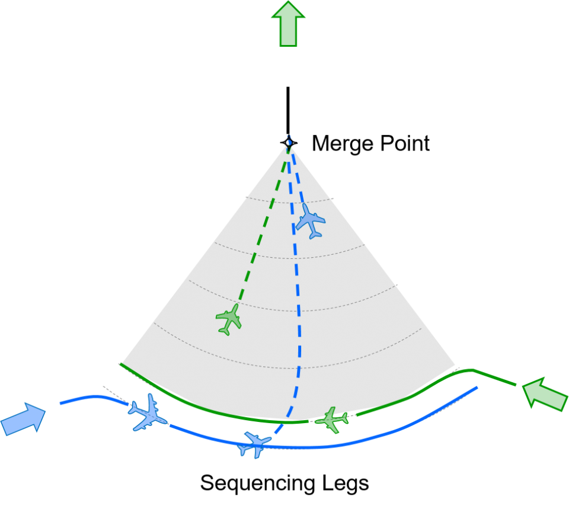

# Kuala Lumpur

Version 1.1 *by BestBearrr*

This file replicates the Lumpur TMA, featuring Kuala Lumpur International Airport (WMKK) and Subang Airport (WMSA).

Transition Altitude is 11000ft, while Transition Level is FL130.
This means that any altitude in between is not to be used (like FL120).

### Features:

* Simulates current operations
* SIDs and STARs, including the new Point Merge System for arrivals 
* Accurate representation of airlines and plane types as much as possible

This file provides a brief overview of the operations at the airports. Check out the sections below for more information about each airport!

The table below shows the skill points at which an airport or runway is unlocked.

| Skill Level | Airport unlocked |                       Runways unlocked                       |
| :---------: | :--------------: | :----------------------------------------------------------: |
|    START    |       WMKK       | **North Flow:** Arrivals - Rwy 32L/33, Departures - Rwy 32R/33 **South Flow:** Arrivals - Rwy 14L/15, Departures - Rwy 14R/15 |
|     10      |       WMSA       |                 WMSA Rwy 15 becomes active.                  |

In Endless ATC, STARs are implemented as approach routes. To activate an approach, an aircraft must be flying direct to an applicable fix, then the APP button can be activated. 

### Installation

------

For PC,

1. Place WMKK.txt in the folder `Endless ATC/locations`

For Android,

1. Place WMKK.txt in the folder `android/data/com.dirgtrats.endlessatc/files/` 

   *(You may need to use a file explorer app)*

### WMKK - Kuala Lumpur International Airport

------

#### Runway information

* **North Flow**

  Arrivals: Rwy 32L, 33
  Departures: Rwy 32R, 33 

* **South Flow**

  Arrivals: Rwy 14L, 15
  Departures: Rwy 14R, 15

Note: Mixed mode operations for runway 33.

Speed control: 160 knots from 10 NM until 5 NM frrom touchdown.

#### Departure Procedures

|  Runway   | SID Suffix | **Initial Climb Altitude** |
| :-------: | :--------: | :------------------------: |
| 14L / 32R |   A / D    |           5000ft           |
| 14R / 32L |   B / E    |           6000ft           |
|  15 / 33  |   C / F    |           4000ft           |

Feel free to radar vector departing aircraft to facilitate separation between arrivals and departures.

#### Approach Procedures

The Lumpur TMA uses the Point Merge technique to sequence arrivals.

*Credits: Eurocontrol*

A quick description about how the Point Merge System works:

* Each point on the sequencing legs, *or arc*, is equidistant from the merge point. The sequencing is achieved with a “direct-to” instruction to the merge point at the appropriate time. For each PMS, there are range rings, in intervals of 5 NM and centred on the merge point, displayed on the radar scope as a means to aid in sequencing.

* In periods of high traffic, it may be prudent to meter aircraft before streaming them into the sequencing legs at the entry points. This is to avoid the PMS from "overflowing", which increases the risks of loss of separation and makes it difficult to sequence traffic effectively.
  * Metering can be achieved by speed reduction, flying extra track miles, or holding.
* Take care to avoid instances of loss of separation between aircraft on the inner and outer leg. By design, the inner leg is designed to be higher than the outer leg. Be careful in descending aircraft on eithersequencing legs to the same merge point. Consider dissociating direct to and descent clearances whenever appropriate.
* Further reading: https://www.eurocontrol.int/concept/point-merge

Each STAR leads to a point merge system. WMKK has four point merge systems:

|           | STAR Suffix |      Outer leg       |      Inner leg       | Merge point | Restrictions at Merge point |
| :-------: | :---------: | :------------------: | :------------------: | :---------: | :------------------------------: |
| PMS East  |     1G      |  FL170- 250 KT  |  FL180+ 250 KT  |    EGURI    |        FL130+ 230 KT        |
| PMS West  |     1H      | 11000ft- 230 KT |  FL130+ 230 KT  |    MESUP    |       8000ft= 230 KT        |
| PMS North |     1K      | 9000ft- 230 KT  | 10000ft+ 230 KT |    NUPKU    |       5000ft+ 210 KT        |
| PMS South |     1J      | 10000ft- 230 KT | 11000ft+ 230 KT |    SULDI    |       6000ft= 210 KT        |

In the Lumpur TMA,

* PMS North and South are not implemented as they are not yet in use.
* Currently, only one PMS is in use at a time, either PMS East or West.
  * PMS East is preferred, but may not be used due to reasons like weather. Consequently, PMS West will be used instead.

* PMS East and West are 'unique' in that after the merge point, aircraft are on downwind; whereas typically, aircraft would be on base, shortly turning final. Make sure to separate aircraft as required to avoid loss of separation when turning base or final.
* **Do remember to assign the landing runway for arrivals when they are flying to the merge point**, as the STAR ends at the merge point (it is easier to implement it this way, due to game limitations).
  * **Choose a different runway by pressing the APP button again.**
* Clear aircraft to descend to different altitudes according to their landing runway.
  * Rwy 14L/32R - 4500ft
  * Rwy 14R/32L - 3500ft
  * Rwy 15/33 - 2500ft
* Simultaneous independent parallel approaches are permitted. However, it is difficult (read: almost impossible) to have independent parallel approaches when aircraft are streamed from only one PMS. Thus, the runway capacity is not able to be fully utilised when only one PMS is in use.
* For a challenge, assign only airlines that operate at KLIA2, typically low-cost carriers (LCCs), to land on Rwy 15/33 only.
  * like AirAsia (AXM/AIQ/AWQ/APG), Xanadu (XAX), Malindo (MXD), Scoot (TGW), Jetstar Asia (JSA), Cebu Pacific (CEB)

#### Further notes:

- **Potential conflict between climbing departures and descending arrivals.**
  - You may wish to vector departures to ensure separation.

### WMSA - Subang Airport

------

#### Runway information

Runway 15 is preferred.

#### Departure Procedures

* **Initial climb is 2500ft.**
* Planes may be cleared to depart on a SID, or are radar vectored with an initial heading of 270 after departure. 
* Be careful not to conflict with WMKK traffic.

#### Approach Procedures

* As turboprops (AT75/AT76) comprise a large amount of WMSA's traffic, arriving planes are simulated to enter at around FL140/FL150, the typical cruising level for turboprops.
  * The limitation is that jet aircraft will also enter at this altitude, which is not really realistic.
* STAR suffix is 1M. STARs incorporate a trombone sequencing technique. Offer track shortening as appropriate.

### Known Issues/Limitations

------

1. WMKK:

   * "Short STAR" (suffix 2J/2K) not implemented.

   * The typical configuration is implemented, meaning to say there are no departures on Rwy 14L or 32L.

2. WMSA: Departures on rwy 33 not implemented.

3. Flight paths, airlines for WMKM Malacca not implemented.

4. Just a note that the airspace in game is slightly larger than the actual TMA to provide some buffer.

### Many thanks to the following resources:

------

1. Civil Aviation Authority of Malaysia - eAIP
2. Wikipedia
3. FlightRadar24
4. FlightAware

### Changelog

------

**Version 1.1** released on 12 February 2023. Developed by BestBearrr.

- Some updates, bug fixes and adjustments.

**Version 1.01** released on 7 November 2022. Developed by dunnebokter12.

* Bug fixes.

**Version 1.0** released on 17 October 2022. Developed by dunnebokter12.

* Initial release.