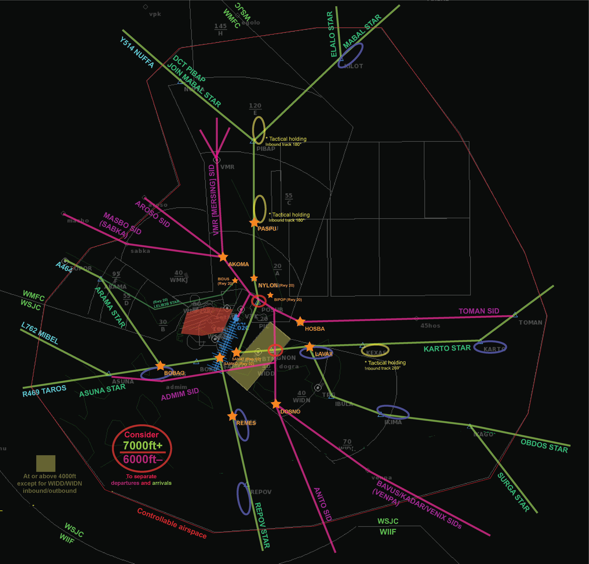

# Singapore TMA v2.1 (2023)

**Version 2.1 (2023)** *by BestBearrr*

**This readme is for version 2.1 (2023), which includes the airspace and procedures in use till early 2024. For the airspace and procedures effective from March 2024, please see the readme for version 3.0+ (2024). **

An attempt at recreating the Singapore TMA, with the following airports:

1. WSSS – Singapore Changi Airport
2. WSSL – Singapore Seletar Airport
3. WIDD – Batam Hang Nadim Airport
4. WMKJ – Johor Senai Airport

### Features

------

* Airspace and procedures until March 2024.
* SIDs and STARs, or flight planned routes, for each airport.
* Accurate airlines and plane types at each airport as much as possible.
* Able to use WSSS interim runway 02R/20L when runway 02C/20C was closed for development works from 2020 to 2023.
  * Includes RNP approaches to runway 02R/20L

### Installation

------

For PC,

1. Place WSSS.txt in the folder `Endless ATC/locations`

For Android,

1. Place WSSS.txt in the folder `android/data/com.dirgtrats.endlessatc/files/` 

   *(You may need to connect your phone via USB to your computer, or use a file explorer app that works)*

### Overview

------

The Singapore TMA is relatively small nearer to the airports and can pose a challenge due to the cluster of airports and narrow airspace available. The difficulty is raised tenfold when bad weather (particularly during the monsoon season) forces aircraft to deviate.

Get ready to vector planes! Though there exist SIDs and STARs, due to the nature of the airspace and procedures, radar vectoring will be essential here. Guide aircraft not just for vectors to final, but also for sequencing, track shortening, maintaining separation between planes bound for different airports, or weather deviation.

Hope you have fun!

------

Transition Altitude: 11000ft
Transition Level: FL130
Any level in between, like FL120, should not be assigned to aircraft.

In Endless ATC, STARs are implemented as 'approach routes'. To clear an aircraft on a STAR, it needs to be flying towards an applicable fix, then you can activate the APP button for the STAR.

The table below shows the skill points at which an airport or runway is unlocked.

| Skill Level | Airport unlocked |                      Runway(s) unlocked                      |
| :---------: | :--------------: | :----------------------------------------------------------: |
|    START    |       WSSS       | Runway 1 (02L/20R) for arrivals Runway 2 (02C/20C) for arrivals & departures |
|     10      |       WSSL       |                         Runway 03/21                         |
|     15      |       WIDD       |                         Runway 04/22                         |
|     22      |       WMKJ       |                          Runway 16                           |
|     35      |        -         |      WSSS Runway 1 (02L/20R) for arrivals & departures       |

The table below shows the various runway configurations available for use.

* Note that odd-numbered configurations are North flow (i.e. runway 02) while even-numbered configurations are South flow (i.e. runway 20).

|        Runway Configuration        |                           Airports                           |
| :--------------------------------: | :----------------------------------------------------------: |
|                1, 2                |                           **All**                            |
|                3, 4                |                       WSSS, WSSL, WIDD                       |
|                5, 6                |                          WSSS, WSSL                          |
|                7, 8                |                          WSSS, WIDD                          |
| 9, 10 *(Oct 2020 - Nov 2023)* | **All **Note: WSSS Rwy 2 (02C/20C) closed, while Rwy 3 (02R/20L) in use. |

If using custom traffic flow rate, a realistic rate (each for arrivals and departures) would be:

* Up to 30-35/h for a chill and relaxing experience
* 35-45/h to experience a typical peak period
* Over 45/h for a very busy and intense experience

### WSSS – Singapore Changi Airport

------

#### Runway information

Runway 1 (02L/20R): Primary Landing Runway

Runway 2 (02C/20C): Primary Departure Runway

Runway 3 (02R/20L): Interim runway used when Runway 2 was closed for works. Only RNP Approach available (via `LUVUL`/`OBGIS`).

Segregated Mode of Operations: Rwy 1 is the primary landing runway while Rwy 2 (or Rwy 3) is the primary departure runway.

#### Departure Procedures

* **Initial climb: 3000ft**

* Take note of minimum altitude restrictions, in particular to the north/west.

  * Planes must also not infringe WIDD (Batam) Control Zone. Planes must be at or above 4000ft.

* Departures can be cleared for high speed climb at your discretion.

* If there is a **simultaneous departure on Runway 1 (02L/20R)**, the departure on Runway 2 (02C/20C) or Runway 3 (02R/20L) may be turned to a diverging heading of 040°/180° to ensure initial separation.

* **Departures from Runway 3 (02R/20L)**

  CHA1C / CHA1D radar departures: Planes climb on runway heading (023°/203°). Vector them as appropriate first, then direct them to their final waypoint when able. *(It is not possible to direct departures to any intermediate waypoints due to game limitations)*

|  Runway   | SID Suffix |
| :-------: | :--------: |
| 02L / 20R |   E / F    |
| 02C / 20C |   A / B    |
| 02R / 20L |   C / D    |

#### Arrival Procedures

**STAR Suffix: Runway 02 - 'A', Runway 20 - 'B'**

STARs are designed to be only runway direction specific (and not for a specific runway). Normally, planes are radar vectored from the last waypoint of the STAR (which is located near the final approach area) to final approach. However, you may radar vector planes at any time if required.

- Last waypoint of the STARs:
  - Rwy 02: `SANAT`, `SAMKO`
  - Rwy 20: `NYLON`, `BIPOP`, `BIDUS`

* Note: Arrivals to WSSS from `Y514 NUFFA` are directed to join the MABAL STAR from waypoint `PIBAP`.
* Speeds like 280 knots may be assigned to aircraft for sequencing.

Arrivals converge at four waypoints (known as "entry gates").

* North: `PASPU`
* East: `LAVAX`
* South: `REMES`
* West: `BOBAG`

Holdings may be carried out at, but are not limited to, these waypoints.

- STARs may contain a _fictional_ altitude point to better simulate the *(actual)* descent profile of a plane as it enters the approach airspace.
- When WSSS runway 20 is in use,
  - For arrivals via `A464 ARAMA`, the default STAR is `ARAMA1B`. The alternative shorter STAR, `LELIB3B`, may be offered by ATC when traffic permits, aka whenever you wish to.
    - To clear an aircraft via `LELIB3B`, click on the APP button twice when the plane is headed to `ARAMA`. (Click once for `ARAMA1B`)
  - A small thing to note: Rwy 20R has a displaced threshold of 740m southwards, so the final approach profile for Rwy 20R is in fact similar to that of Rwy 20C and 20L. (i.e.  if referring to the runway extended centerline in the game, the depicted profile is very slightly different from reality due to the displaced threshold)

More information on the approach procedures:

- **Speed control:** **180 knots by 8 NM** from touchdown, and thereafter **150 knots until 4 NM** from touchdown.
- Handoff to Tower anywhere within ~10nm.

* **ILS Approach to runway 02L / 20R**

  * Usually, planes are cleared to intercept the localizer first, and only when established on the localizer that they are cleared for the ILS approach (localizer + glideslope).
* Most of the time, planes are cleared to descend to **2500ft** to intercept, but other altitudes are alright too.
  
* **RNP Approach to runway 02R / 20L**

  * Vector aircraft as usual, when nearing the extended centerline or as appropriate, direct the aircraft to `LUVUL`/`OBGIS`* and clear the aircraft for the RNP approach. Descend the aircraft to 2000ft, then/or to **1700ft**.

    _* `LUVUL`/`OBGIS` is the intermediate fix of the approach._

* **Simultaneous (independent/dependent) parallel approaches to both runways**

  * Used especially during periods of high arrival traffic/congestion. Increases landing capacity as both runways are utilised for landings. Ensure planes are separated by at least 3nm or 1000ft until localizer intercept.
  * Only dependent parallel approaches to runway 1 (ILS) and runway 3 (RNP) authorised.

* **Missed Approach/Go Around**

  * Continue on runway heading and climb to 3000ft or as appropriate (e.g. 4000ft).

* **Wake Turbulence Separation** 

  * ICAO RECAT separation is applied between landing aircraft.

#### Further notes:

- **Potential conflict between climbing departures and descending arrivals**:
  - Particularly east of the airport, near `DOGRA`/`IGNON` waypoints.
  - To prevent the risk of loss of separation, clear departures to climb to no higher than 6000ft, and descend arrivals to no lower than 7000ft. (or 8000ft–/9000ft+)

### WSSL – Singapore Seletar Airport

------

#### Runway information

Runway 03/21: Visual approach only

Rwy 03 glidepath: 3.2°
Rwy 21 glidepath: 3.5°

Seletar is a challenging airport to land at or depart from. With a really tight control zone, nearby runways with similar orientation, and noise abatement areas, pilots have to be careful to keep all turns within the Seletar Control Zone while landing at the correct airport and complying with noise abatement procedures.

* There is no SID or STAR, rather, **departure and joining procedures (arrival) from two directions** form the backbone of WSSL's routing.
  * **Via the North:** Waypoint `OMKOM`
  * **Via the South:** The procedure `SJ-PONJO-RECHI` (for arrivals) or its inverse `RECHI-PONJO-SJ` (for departures)

#### Departure Procedures

* **Initial climb: 3000ft**
* Runway 03 departures (to the North) are assigned heading 360
* Runway 21 departures (to the South) track `RECHI-PONJO-SJ` before being vectored to their final waypoint.
  * Vector departures to their exit waypoints. Ensure separation with other traffic and altitude restrictions.
  * Deviation is not permitted on `RECHI-PONJO` or `RECHI-PONJO-SJ`.

* *The following are not implemented in this file, but you may vector planes as such if you wish to simulate it.*
  * *Rwy 03 departures may turn left for downwind to track `SETHI-RECHI-PONJO-SJ` to depart to the South.*
  * *Rwy 21 departures may turn right for downwind, then fly heading 360 to depart to the North.*
  * *Reminder that aircraft are to keep all turns within Seletar Control Zone.*

#### Arrival Procedures

By default, arrivals continue on their flight planned routes towards WSSL with the final waypoint being `OMKOM` or  `SJ`. This may or may not be the ideal routing in the airspace. As such, **radar vectors <u>will be necessary</u> to bring arrivals towards the airport**.

During congestion or bad weather, there may be a need to delay aircraft. Tactically issue holding instructions or delay vectors to aircraft.

* For approaches via the North, planes are often vectored to position for visual approach to the runway.

* For approaches via the South, planes are to proceed direct to `SJ` (or `PONJO` if available), to track via `SJ-PONJO-RECHI` for visual approach to the runway. Aircraft are to strictly follow `SJ-PONJO-RECHI` or `PONJO-RECHI` routing; deviation is not permitted.

The joining procedures are outlined in greater detail below. 

* Runway 03:
  * From the North: Position to join left-hand downwind to runway 03 via either of the two 'helper points', `VIS03A` or `VIS03B`, **at 1500ft**.
  * From the South: Track direct to `SJ` or `PONJO` , following the `SJ-PONJO-RECHI` joining procedure for a <u>**straight-in visual approach**</u> to runway 03.
* Runway 21:
  * From the North: Position to join final for a <u>**straight-in visual approach**</u> to runway 21 via the 'helper point', `VIS21`, **at 2000ft** (or 1500ft).
  * From the South: Track direct to `SJ` or `PONJO`, following the `SJ-PONJO-RECHI-SETHI` joining procedure for a right-hand downwind to runway 21.
* In particular for approaches via downwind,
  * Aircraft are to keep all turns within Seletar Control Zone.
  * *Also note that in the game, some aircraft may not be able to make the turn to final to land due to higher speeds. They will make a go around and you can bring them around to join for a straight-in approach instead of via downwind.*

**Tip:** You can temporarily use a different runway config to allow a plane to land on the opposite side of your active flow. This may be particularly useful for WSSL.

Take note maximum tailwind component of 10 knots is allowed for landings. Also if planes are unable to land due to weather, they should be in holdings or diverted.

### WIDD – Batam Hang Nadim Airport

------

#### Runway information

Runway 04: ILS approach

Runway 22: Only VOR/DME approach available.

There is no SID or STAR, rather, radar vectoring is the primary tool to control WIDD traffic.

*In real life, the initial departure and final approach segments (at or below 3000ft) are controlled by Tanjung Pinang Approach Control, but it is not possible to make this distinction in game.*

#### Departure Procedures

* **Initial climb: 3000ft**
* Departures to the North (to `SABKA A457` or `AROSO Y513` or `VMR`) may be instructed to turn towards the north, and may pass through Changi Control Zone at or above 4000ft.
* Departures to all other waypoints will be instructed to turn towards the South.
* Vector departures to their exit waypoints. Ensure separation with other traffic and altitude restrictions.

#### Arrival Procedures

By default, arrivals continue on their flight planned routes towards WIDD with the final waypoint being `JITLM` or `BTM`. This may or may not be the ideal routing in the airspace. As such, **radar vectors <u>may be needed</u> to bring arrivals towards the airport**.

* Runway 04: Descend to 2000ft for ILS approach.
* Runway 22: Descend to 2000ft for VOR/DME approach. Use the 'helper point' `VOR22`.
* *Visual approaches may be conducted in real life, but are not implemented.*

### WMKJ – Johor Senai Airport

------

#### Runway information

Runway 16: ILS approach
*Runway 34 is not implemented as it is rarely used for arrivals; only visual approach (or RNP Z (AR) for authorised aircraft) available.*

*In real life, the initial departure and approach segments in the Johor TMA are controlled by Johor Radar, but it is not possible to make this distinction in game.*

As only departures and arrivals to the East (via `G580`) and South (via `G579`, `B470`) will pass through Singapore's control, only these are implemented. _Traffic to/from the North will also pass through Singapore's control, but for playability it is decided not to be implemented at this time._

In game, planes will mainly route via `OMKOM` SID/STAR or `PIMOK` STAR for arrivals.

#### Departure Procedures

* **Initial climb: 6000ft**
* Departures are cleared via `OMKOM1E` departure to `OMKOM`, then onto their flight planned routes. There may or may not be a need to vector aircraft.
* To keep clear of prohibited area WMP228.

#### Arrival Procedures

By default, arrivals continue on their flight planned routes then on the STAR towards WMKJ (`PIMOK2J/OMKOM2J`). This may or may not be the ideal routing in the airspace. As such, **radar vectors <u>may be needed</u> to bring arrivals towards the airport**.

* Runway 16: **Descend to 6000ft** at `PIMOK`/`OMKOM` to join `PIMOK2J`/`OMKOM2J` arrival, which will guide the aircraft to descend to 2000ft for ILS approach.
* *RNP Z (AR) approach for authorised aircraft may be conducted but is not implemented here.*

### Known Issues/Limitations

------

1. Conflicts between inbound planes may arise around the entry points near the airspace boundary if the game generates the planes too close to one another. Unfortunately this is RNG.
2. WSSL: The game may generate a departure from runway 03 while another plane is positioning for left hand downwind visual approach to runway 03 from the north (via `VIS03A`/`VIS03B` 'helper points'). This may cause a conflict, so be careful and hope a departure isn't generated.
3. WSAP Paya Lebar Airport and WIDN Tanjung Pinang Airport are deliberately not included owing to the low traffic volume at these airports.
4. Some coastlines could be better depicted. May improve at a later date. (It takes a lot of effort...)

### Changelog

------

**Version 2.1 (2023)** released on 16 January 2024. Developed by BestBearrr.

- Added WIDD, WMKJ airports
- Added WSSS Runway 02C/20C, Improved WSSL
- Updated controllable airspace boundary in game
- Added various runway configurations for more options
- Adjustments to prohibited/restricted/danger areas
- Minor enhancements to procedures
- Modifications to the characteristics of some plane types, mainly to allow the speed assignment of 150 knots

**Version 2.0** released on 31 December 2022. Developed by BestBearrr.

- Initial release of Singapore TMA with WSSS and WSSL
  - WSSS interim runway 02R/20L

**Version 1.3** released on 11 August 2021. Developed by Jacob.

_Disclaimer: The information included herein is not meant to be realistic, but for recreational use only._