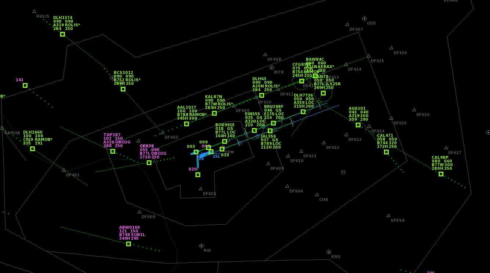

# Frankfurt Airport

The 4th biggest airport by traffic in Europe and the biggest airport in Germany. EDDF has 4 runways, one exclusively used for takeoffs. Frankfurt Airport offers a wide variety of international airlines and heavy aircraft. Together with Leipzig and Cologne/Bonn Frankfurt is also a very big freight hub in Germany.

## Differences to the default airport

- Many SIDs (Standard Instrument Departures) implemented which give you a feel of the real procedures in Frankfurt.
- Many STARs (Standard terminal arrival route) / transitions implemented from SPESA, KERAX, ROLIS and "RAMOB" (not a real STAR, a design choice to keep the airport smaller). The arrivals help manage high amounts of traffic.
- Many fixes added which can be given as a direct to arriving aircraft.
- Updated airlines and traffic, mostly pre-pandemic (it would be boring without A380s...)

## Some tips on how it can be played

- Transitions can help with high traffic, but are usually skipped if possible.
- Airbus A380 (A388), Boeing 747s (B744 and B748) and McDonnell Douglas MD-11 (MD11) must land on runway 25L/07R as they are not allowed on the shorter runway 25R/07L (not sure if actually not allowed or just not common).
- I like to play with Skill Cap 24 as it get's challenging from time to time. For beginners or players who like to play more relaxed 16-20 might be better.
- I did not include approaches via every waypoint like in EDDM because waypoint + heading 070/250 in Frankfurt works fine.

## Limitations, TODOs and help wanted!

**Note: ** Please don't edit the EDDF.txt file directly as it is generated via a script that is not public currently.

- Arrivals via UNOKO are not possible, a shorter imaginary STAR via RAMOB is available. I wanted to keep the already big airspace a bit smaller.
- Separation incidents between departing traffic happen occasionally, not sure if that is fixable.
- Sometimes traffic might climb too slow to exit the south of the airspace in time.
- Traffic balance between airlines is not perfect, freight airlines might be a bit too common.
- Some SIDs and arrival procedures might be a bit unrealistic, as I'm not an expert when it comes to Langen Radar and Frankfurt. Feedback via Github Issue or via Discord is welcome!
- Aircraft arrivals might be unevenly distributed between north and south.
- Altitude restrictions might be missing. Was too lazy to look into that.

## Changelog

### v1.0

- Initial release

