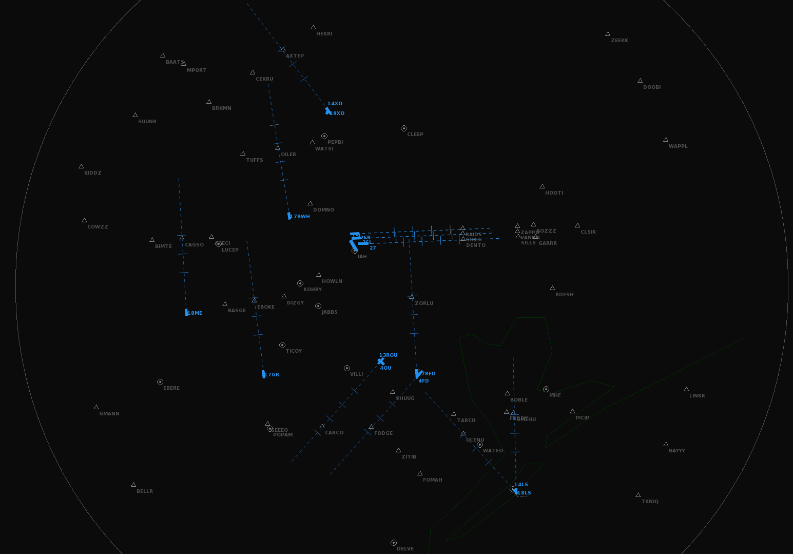
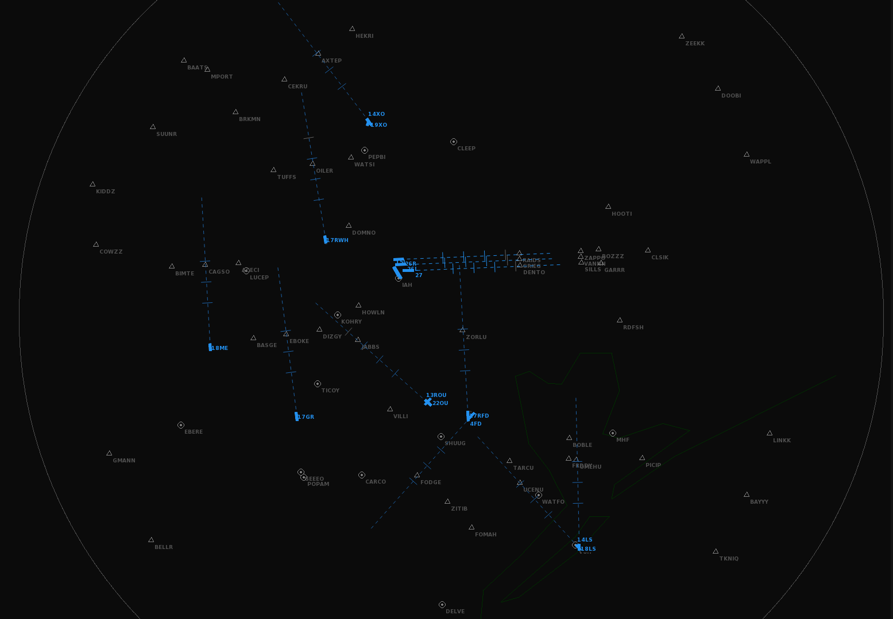
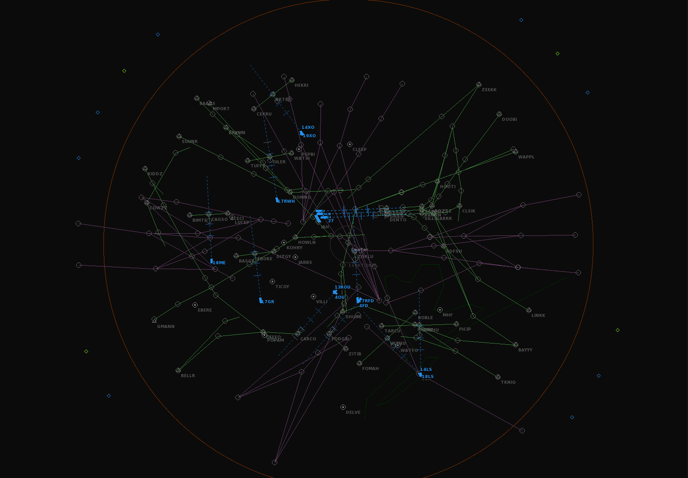

# Houston Georege Bush Intercontinental Airport and Satellite Fields
This airport file set KIAH as the main airport and includes 7 additional satellite airports that service the Houston area. The traffic pattern is west flow into KIAH.

# Airspace Configuration Maps
## 13R KHOU Arrival configuration

## 04 KHOU Arrival configuration

## Features
### STARs
Aircraft entering the airspace are assigned and will automatically follow a STAR unless otherwise assigned by the user. STARs to class B airports have altitude and speed profiles that the aircraft will follow unless otherwise assigned by the user.

STARs to KIAH have multiple routes that the user can assign. See below for how to assign a particular STAR route.

### ILS / RNAV Approaches
Aircraft can be assigned and will automatically fly an assigned ILS / RNAV approach. The aircraft descend and then capture the ILS / RNAV glideslope automatically. Aircraft must be able to descend in time to able to capture the approache, if they are too high, they will miss approach! Plan accordingly!

## SID / STAR Routes
STARs / ILS and RNAV approaches are in **GREEN**

SIDs are in **MAGNETA**
## 13R KHOU Arrival configuration

## 04 KHOU Arrival configuration

# Airports
## KIAH - George Bush Intercontinental Airport 
### SIDs from 15R and 15L
- BELTWY SEVEN
- BNDTO FIVE
- FLYZA FIVE
- HOODO7 SEVEN
- INDIE EIGHT
- LURIC EIGHT
- RITAA SIX
- STYCK EIGHT
- WYLSN EIGHT

### STARs
- DOOBI TWO 26L
- DRILLER FIVE 26R, 26L, and 27 user assignable
- LINKK ONE 26L and 27 user assignable
- MSCOT FOUR 26R, 26L, and 27 user assignable
- SOULL ONE 26L and 27 user assignable
- TEJAS FOUR 26R, 26L, and 27 user assignable

# History

## Version 3.0
Update file to include changes to Endless ATC Version 5.0.3 and add class D airports in the Houston area.

### Airspace
- Set minimal altitude for arrivals to 5000 feet
- Set above altitude to 15001 feet to clear the Bravo airspace
- Added and removed lines of code to match example template for Endless ATC version 5.0.3
- Added center handoff frequencies

### Airport 1 George Bush Intercontinental Houston Airport
- Added starting altitude to entry points
- Added tower frequencies
- Updated properties to support Endless ATC version 5.0.3

### Airport 2 Hobby
- Added starting altitude to entry points
- Added tower frequencies
- Updated properties to support Endless ATC version 5.0.3
- traffic flow is set to 3x real life traffic flow

### New Class D Aiports
- KCXO : Conroe Reginal Airport with RNAV with RNAV approach
- KDWH : David Wayne Hooks with RNAV with RNAV approach
- KEFD : Ellington Field with RNAV with RNAV approach
- KSGR : Suglar Land with RNAV with RNAV approach
- KGLS : Scholes / Galveston with RNAV approaches
- KTME : Houston Executive with RNAV approach

### New STARS
- Added STARs that feed into the new class D airports

### New SIDS
- Added SIDs that lead traffic away from the new class D airports

## Version 2.2
### Beacons
- Added the Freddy beacon for the BAYYY 4 arrival

### Approaches
- Changed runways to change APP sequence for TEJAS arrival selection, defaults to 27
- Added BAYYY4 arrial starting at Freddy for KHOU
- Changed runways to change APP sequence for SOULL arrival selction, defaults to 27

## Version 2.1
 
Incoporates suggestions and recommendations from Discord reviewers ARH1 and obamna

### Beacons
- removed approach and missed approach beacons for KHOU 22 and 31L
- Added DOMNO beacon for KIAH downwind entries
- Added SHUUG beacon for KHOU4 downwind entries
- Added VILLI beacon for KHOU13R downwin entries
 
### Airport 1
- set climbaltitude = 4000

### Airport 2
- set climbaltitude = 5000

### Configurations
- deleted config3 and config4
- config1 D13R and A4
- config2 D22 and A13R

### Depatures
- removed KHOU 4 and 31L depatures

### Approaches
- removed approaches for KHOU 22 and 31L
- added DRLLER and TEJAS entry points at DOMNO and HOWLN
- added BAYYY entry point at SHUUG
- added BAYYY entry point at VILLI

## Version 2.0

Template file was forked from https://github.com/EndlessATC/Airports
Navedata such as beacons, STARs, SIDs, and final approach data from https://skyvector.com/
Operating airlines for KIAH https://www.fly2houston.com/iah/airlines
Operation airlines for KHOU https://www.fly2houston.com/hou/airlines
Rules for starting an approach at the IF https://blog.aopa.org/aopa/2014/01/28/three-ways-to-start-an-instrument-approach-vectors-iaf-and-intermediate-fix-if/
Traffic patterns from my aviation knowledge and living in the Houston area

This build is intended match the traffic flow during calm / prevaling wind conditions focused on arrivals from the east. Therefore, this file only has one runway configuration and the STARs that feed those runways. SIDs are also matched to the most common depature runways. 13R is the common arrival for Hobby. 22 and 4 can flip as they are crosswind for a prevailing SE wind. I chose 22.
		
### General
- Added formatting to make major sections stand out
- Included comments on approach / departure section to describe which beacons are used to define route

### Airspace updates
- set magneticvar to 2.3, to match variation as of 1/2022
- added missing default items lines (pulled form example.txt)
- removed boundary box and used default airspace circle
- update airspace radius to 60 nm
- set transition airspace to 18000'
- set ceiling to 10000 feet to match top of class B
- set above to 12000 feet (exit class B airspace)
- set automatic to true, aircraft follow the STAR as the would in real life
- removed excess waypoints
- only entry waypoints for STARs and missed approach holds are visible
- moved center of airspace to better match the working airspace
- removed random green line that was to the west of airspace
- added airspace boundary to restrict size of playing area. Generally marks 15000 foot entry point for STARs
- letters set to 0; should be airline then flight number

### Airport 1
- set climbaltitude = 3000 to match SIDS real life
- primary runways defined for west flow arrivals
- changed runway identifier to be more descriptive
- updated entry points to match 15,000 transition of STARs
- updated the airlines to match airlines operating KIAH as of 1/2022
- updated airlines / airplane types to match equipment that flies into KIAH
- increased frequency of United Airlines to 10, they fill the skies here

### Airport 2
- set climbaltitude = 3000 to match SIDS real life
- updated airliner list
- added flow of 10

### Configurations
- updated config1 and config2 to match calm / prevailing wind pattern
- added config3 and config 4 to use any runway pattern at hobby aiport

### KIAH Transitions to Final Approach Approaches 1001-1011
- added instrument approach transitions, aircraft assigned these procedures will follow a route to ILS and switch over and lock automatically

### KIAH Arrivals 1101-1117
- modified, added the following STARs DOBI TWO, DRLLR FIVE, LINKK ONE, SOULL ONE, TEJAS FOUR, and ZEEKK TWO. STARs are used for west flow arrivals

### KIAH Departues 101-102
- depatures are defined by approach flow! departuress set for west flow arrivals
- modeified, added the following SIDs BELTWY SEVEN, LURIC EIGHT, STYCK EIGHT, WYLSN EIGHT, INDIE EIGHT, BNDTO FIVE, HOODO, FLYZA, RITAA, and MMUGS

### KHOU Transitions to final Approach Approaches 2001-2005
- added instrument approach transitions, aircraft assigned these procedures will follow a route to ILS and switch over and lock automatically

### KHOU arrials
- modified, added the followign STARs, BAYYY FOUR, BELLR FOUR ,KIDDZ FOUR, PUCKS FOUR, TKNIQ THREE, SOULL ONE, and WAPPL SIX

### KHOU departures
- added BELTWY SEVEN, LURIC EIGHT, STYCK EIGHT, WYLSN EIGHT, INDIE EIGHT, ELOCO FIVE, HOODO SEVEN,  PTRON SEVEN, and RETYR SIX for all 4 runways.
 
## Version 1.0
Author Unknown
A380's for funzies
Some special airlines :)